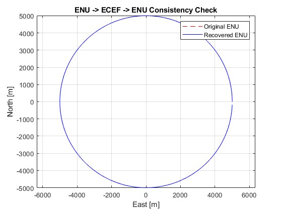
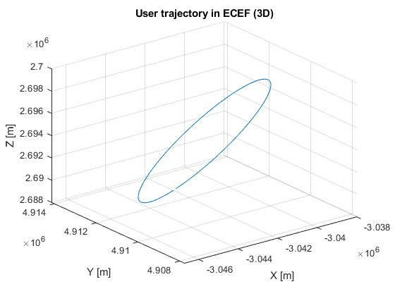
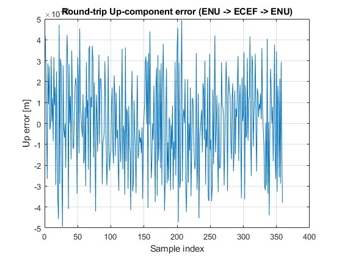

# 🌍 ENU–ECEF Circle Consistency Demo (MATLAB)

This repository demonstrates coordinate transformation consistency for a circular trajectory
generated in **local ENU coordinates** and converted to:

**ENU → ECEF → ENU**

It verifies whether the round-trip transformation preserves geometry.

---

## 📌 Overview

We generate a circular orbit around a specified reference point defined in **LLH** (Latitude-Longitude-Height).
Then:

1. Convert ENU → ECEF using `llh2xyz`, `enu2xyz`
2. Convert back ECEF → ENU using `xyz2enu`
3. Compare **original vs reconstructed ENU** trajectories

This process is useful in:
- GNSS simulation
- LEO satellite attitude/orbit code verification
- Geodetic coordinate transformations
- UAV or robotics localization

---

## 🧠 Key Idea

A perfect transformation must satisfy:

\[
\text{ENU} \rightarrow \text{ECEF} \rightarrow \text{ENU}
\approx \text{original ENU}
\]

Any deviation indicates numerical error or model inconsistency.

---

## 📁 File Structure


---

## 📷 Simulation Outputs

### 1️⃣ Circular ENU trajectory



The ENU circle is generated around a reference point in local tangent plane.

---

### 2️⃣ Projection in ENU / ECEF


Shows the projected circle and its transformed equivalent.

---

### 3️⃣ 3D Geometry



Shows how the circle maps in global Earth-Centered Earth-Fixed coordinates.

---

### 4️⃣ Round-Trip Error



If the transformations are correct, the error should remain close to zero.

---

## 🚀 Usage

Clone or download this repository.

```bash
git clone https://github.com/<your-username>/enu-ecef-circle-demo.git

---

# 💡 Important Tips

### 🟢 Put screenshots **inside the repo**
You already uploaded:
- `3d.jpg`
- `proj.jpg`
- `error.jpg`
- `back_circle.jpg`

So just reference them like:

```markdown

